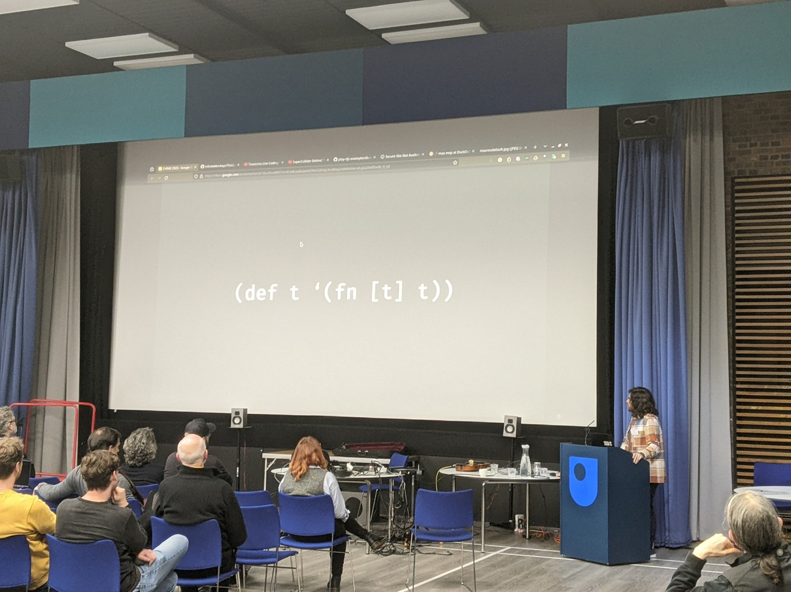
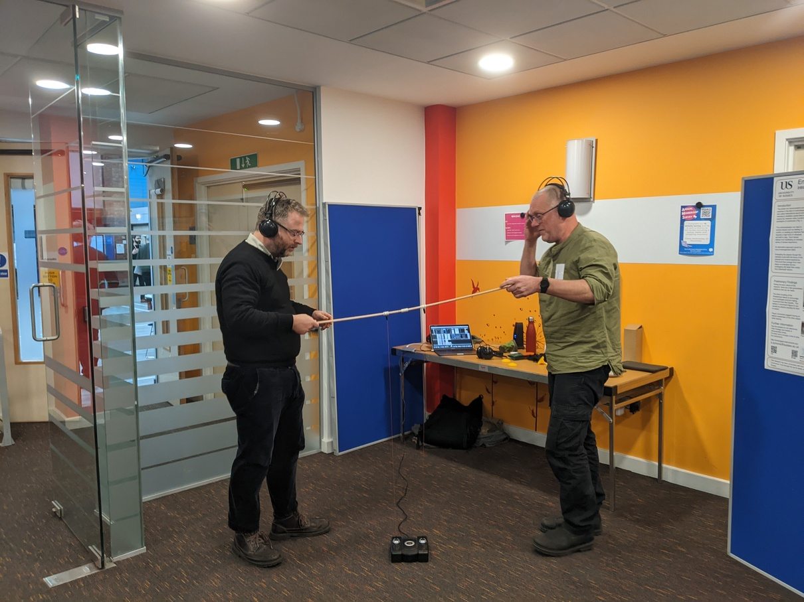
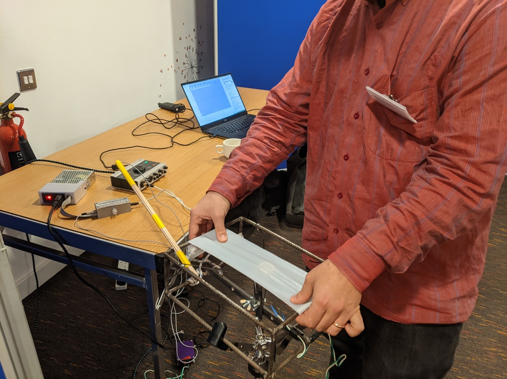
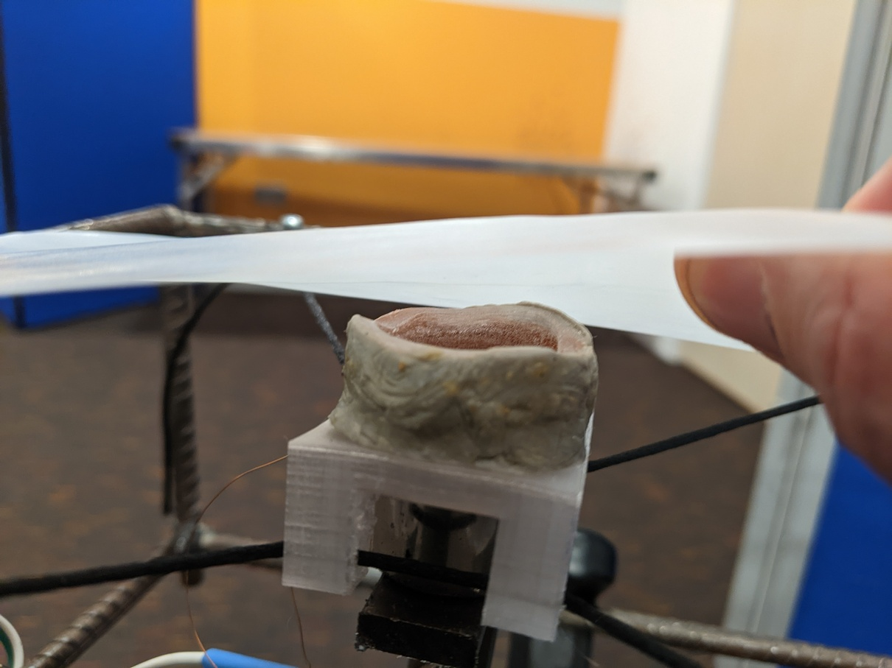
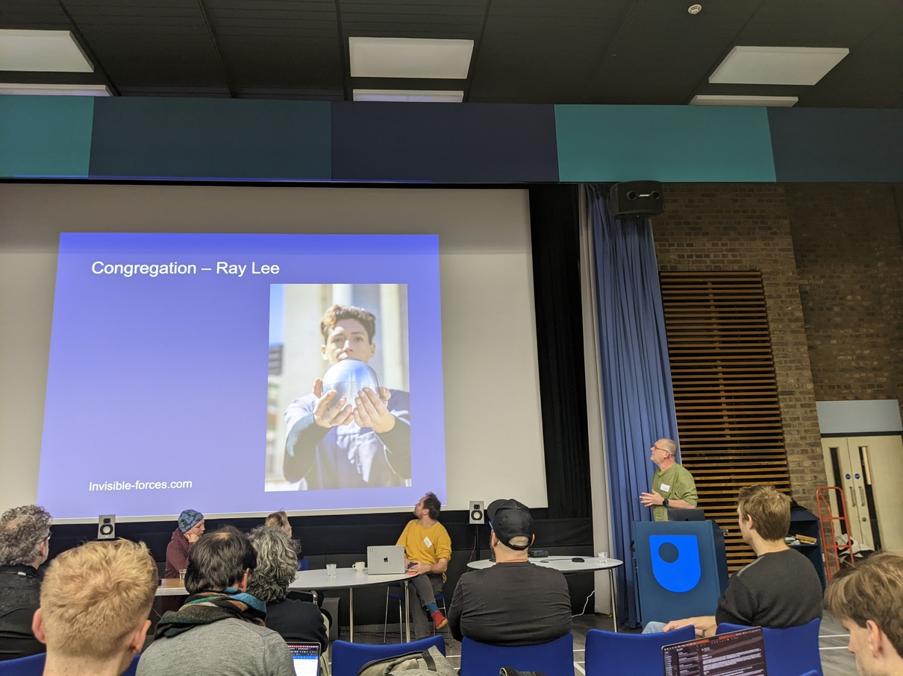

Emute Lab members Steve Symons, Dimitris Kyriakoudis and Chris Kiefer presented their work at the <a href="https://www.chime.ac.uk/chime-annual-workshop">CHIME annual workshop</a> in December, <i>'a one-day research event for sharing work in the area of music and human-computer interaction, with a particular emphasis on participative hands-on demos'</i>. 

 

Steve presented his work on entangled instruments <a href="https://entangled-instruments.xyz">https://entangled-instruments.xyz/</a>, and also took part in the afternoon panel session.

<a href="https://www.chime.ac.uk/s/CHIME-Abstract-Symons.pdf">https://www.chime.ac.uk/s/CHIME-Abstract-Symons.pdf</a>

 

Dimitris presented his work on his livecoding instrument Timelines.

<a href="https://github.com/lnfiniteMonkeys/TimeLines-hs">https://github.com/lnfiniteMonkeys/TimeLines-hs</a>

 
<a href="https://www.chime.ac.uk/s/CHIME-Abstract-Kyriakoudis.pdf">https://www.chime.ac.uk/s/CHIME-Abstract-Kyriakoudis.pdf</a>

 
Chris showed his new instrument, the Nalima, which explores multistable musicianship.

<iframe width="560" height="315" src="https://www.youtube.com/embed/y3uq0skcnB0?si=9ksfu9smmzt5iKZv" title="YouTube video player" frameborder="0" allow="accelerometer; autoplay; clipboard-write; encrypted-media; gyroscope; picture-in-picture; web-share" allowfullscreen></iframe>

<a href="https://www.chime.ac.uk/s/CHIME-Abstract-Kiefer.pdf">https://www.chime.ac.uk/s/CHIME-Abstract-Kiefer.pdf</a>

 
Some images of the event:
 

 
Dimitris' presentation
 

 
Steve demos the Stickatron presentation
 

 
Trying out Chris' Nalima instrument
 

 
The Nalima takes some heat damage, time for a rethink about cooling the voicecoil!
 

 
Steve's presentation for the afternoon panel
 

